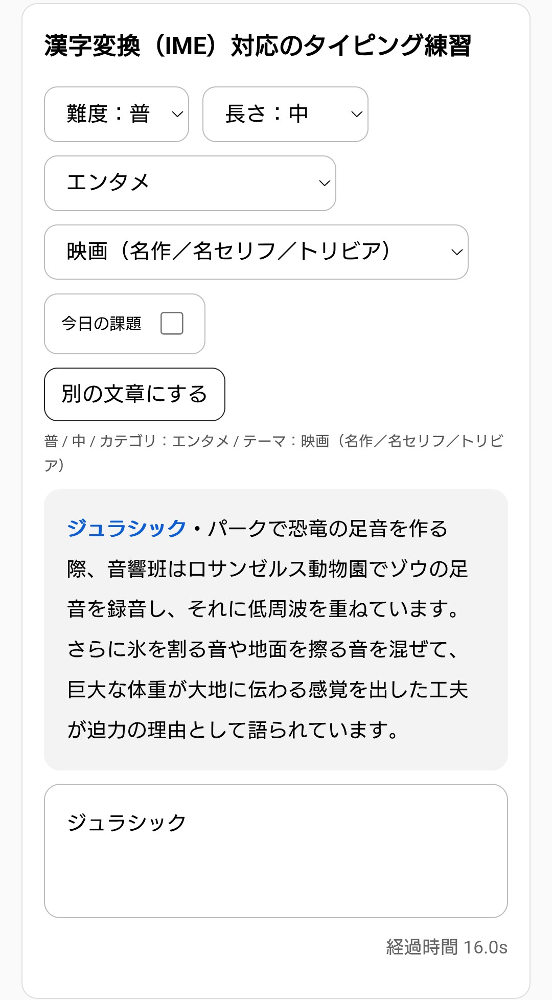

# 漢字変換タイピングゲーム  
### 社会人向け日本語入力練習（IME対応）

🔗 https://espresso-taro.github.io/Otonano-typing-game/

> English: see [README.en.md](./README.en.md)

---

## スクリーンショット


---

## 概要

**漢字変換（IME）を含めた日本語入力を実践的に練習できる、社会人向けタイピングゲーム**です。  
一般的なローマ字入力中心のタイピング練習とは異なり、  
**「読む → 入力する → 変換する → 正確に仕上げる」**という、仕事で実際に必要な日本語入力プロセスをそのまま練習できます。

会員登録不要・無料で、PC・スマートフォンの両方に対応しています。

---

## 特徴

- **漢字変換（IME）対応**  
  ローマ字入力だけでなく、変換操作まで含めてスコア判定します。

- **社会人向けの文章内容**  
  雑学・豆知識を中心に、実務に近い語彙・文体を使用しています。

- **CPM（Characters Per Minute）によるスコア評価**  
  日本語入力に適した指標で、速度と正確性を総合的に評価します。

- **成長グラフ表示**  
  日々のスコア推移を自動で可視化し、上達を確認できます。

- **ランキング・グループ対戦**  
  全国ランキング、今日の課題ランキング、身内グループでの対戦に対応。

- **スマートフォン対応**  
  フリック入力・外付けキーボードのどちらでも利用できます。

---

## 一般的なタイピングゲームとの違い

多くのタイピングゲームは **ローマ字入力の速さ**に寄りがちです。  
本サイトは **IME変換を含めた日本語入力**を前提にしているため、仕事で必要な入力スキルに直結します。

- 変換候補の選択
- 変換確定のタイミング
- 読みの分解
- 正確な文章仕上げ

を含めて練習したい方に向いています。

---

## 使い方

1. ユーザーを選択または作成  
   （1台の端末で複数人の成績を分けて管理可能）

2. 必要に応じてグループを作成・参加  
   （グループ内ランキングにスコアが記録されます）

3. 難易度・文章長・テーマを選択  
   （迷った場合は「今日の課題」がおすすめ）

4. 文章を読み、IMEで漢字変換しながら入力

5. スコア・ランキング・成長グラフを確認

---

## 向いている人

- 社会人・大人向けの日本語タイピング練習を探している
- ブラインドタッチはできるが、**漢字変換が遅い／ミスが多い**と感じる
- **実務レベルの入力速度と正確性**を上げたい
- 成長を数値・グラフで確認しながら継続したい
- 友人・同僚・クラスでランキングを作って習慣化したい

---

## 仕様（要点）

- JavaScriptが有効な環境が必要です
- 入力データは **ブラウザ内で処理**され、外部に送信されません（※実装に依存）
- IMEの挙動は、OS／ブラウザ／IME設定に依存します

---

## 技術情報（簡易）

- フロントエンドのみ（HTML / CSS / JavaScript）
- GitHub Pages による公開

---

## なぜIME対応にしたのか（思想・設計意図）

一般的なタイピング練習は「ローマ字入力速度」に寄りやすく、  
**仕事で頻繁に発生する“変換・確定・修正”の動作**が練習対象になりにくいという課題があります。

本プロジェクトは、次の前提で設計しています。

- 仕事の入力は「タイピング」ではなく **日本語入力（文章制作）**である  
- 実務で困るのは「打鍵速度」より **変換・確定・誤変換修正**  
- 継続しないと伸びないため、**ランキングやグラフで習慣化**を支援する

そのため「IME変換込みで練習できること」を中核価値にしています。

---

## 開発・ローカル実行（例）

静的サイトなので、ローカルサーバーで開くだけで動作します。

例（Python）:

```bash
python -m http.server 8000
